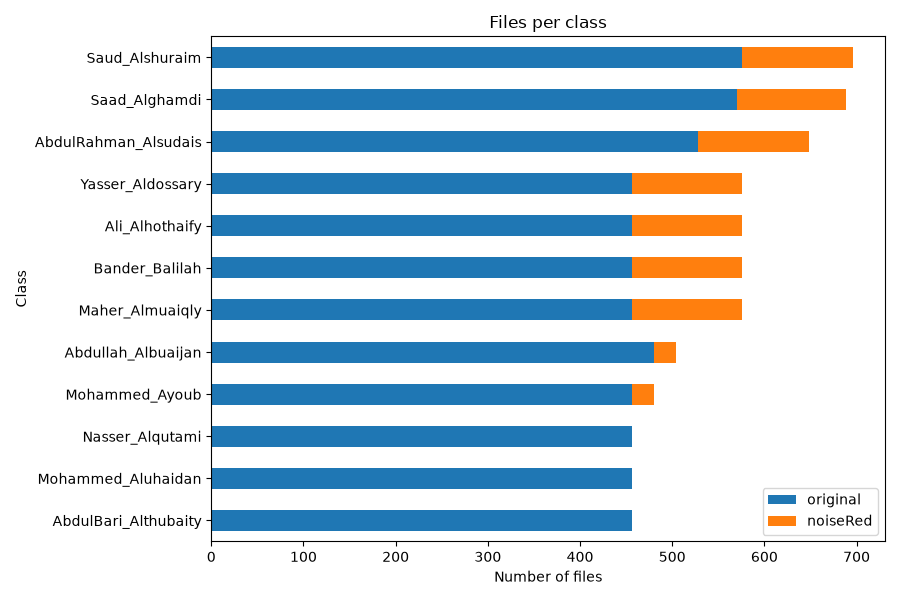
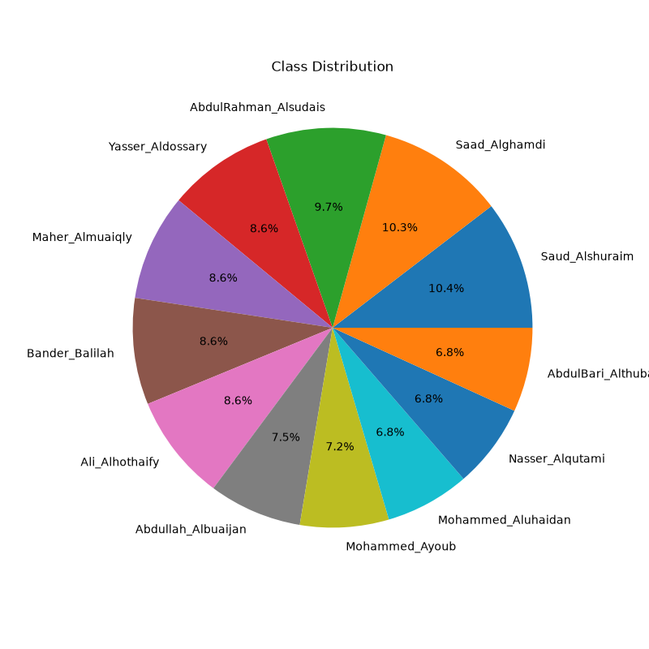

# 🕌 Quran Reciter Classification

A deep learning project that classifies Quran reciters from audio clips using a **Convolutional Neural Network (CNN)** built with **PyTorch**.

The model converts raw audio into **Mel-spectrograms** and learns to identify the reciter from the visual patterns in the spectrogram.

---

## 📋 Table of Contents

- [Overview](#overview)
- [Dataset](#dataset)
- [Architecture](#architecture)
- [Project Structure](#project-structure)
- [Installation](#installation)
- [Usage](#usage)
- [Results](#results)
- [Technologies](#technologies)
- [License](#license)

---

## Overview

Each Quran reciter has a distinct vocal signature — tone, rhythm, tajweed style, and pronunciation. This project leverages those differences by:

1. Converting audio clips into **Mel-spectrograms** (128 × 256 images)
2. Feeding them into a **3-layer CNN** for classification
3. Outputting the predicted reciter

<p align="center">
  
</p>

---

## Dataset

The dataset is sourced from Kaggle: [Quran Recitations for Audio Classification](https://www.kaggle.com/datasets/mohammedalrajeh/quran-recitations-for-audio-classification)

- **Audio format:** WAV
- **Duration:** First 5 seconds of each clip are used
- **Variants:** Includes both original and noise-reduced versions
- **Split:** 70% Train / 15% Validation / 15% Test (stratified)

<p align="center">
  
</p>

> **Note:** The dataset is not included in this repository due to its size. Download it from Kaggle and place it in `data/`.

---

## Architecture

```
Input: (batch, 1, 128, 256)  — Mel-spectrogram
           │
    ┌──────▼──────┐
    │  Conv2d(16)  │ → ReLU → MaxPool2d
    └──────┬──────┘
    ┌──────▼──────┐
    │  Conv2d(32)  │ → ReLU → MaxPool2d
    └──────┬──────┘
    ┌──────▼──────┐
    │  Conv2d(64)  │ → ReLU → MaxPool2d
    └──────┬──────┘
           │ Flatten
    ┌──────▼──────┐
    │ FC(32768→4096)│ → ReLU → Dropout
    │ FC(4096→1024) │ → ReLU → Dropout
    │ FC(1024→512)  │ → ReLU → Dropout
    │ FC(512→N)     │ → Logits
    └─────────────┘

Output: (batch, num_classes)
```

**Hyperparameters:**

| Parameter | Value |
|---|---|
| Batch Size | 16 |
| Learning Rate | 1e-4 |
| Epochs | 25 |
| Optimizer | Adam |
| Loss Function | CrossEntropyLoss |
| Dropout | 0.5 |

---

## Project Structure

```
QuranClassification/
├── data/                        # Dataset (not tracked by git)
│   ├── Dataset/                 # Audio files organized by reciter
│   └── files_paths.csv          # File paths and class labels
├── dataexploratory.py           # EDA: download, inspect, visualize dataset
├── soundclassification.py       # Model training, evaluation, and saving
├── class_distribution.png       # Bar chart of class distribution
├── class_pie.png                # Pie chart of class distribution
├── .gitignore
├── requirements.txt
└── README.md
```

---

## Installation

### Prerequisites

- Python 3.10+
- An NVIDIA GPU with CUDA support (recommended)

### Steps

1. **Clone the repository**

   ```bash
   git clone https://github.com/<your-username>/QuranClassification.git
   cd QuranClassification
   ```

2. **Create a virtual environment**

   ```bash
   python -m venv .venv
   .venv\Scripts\activate       # Windows
   # source .venv/bin/activate  # Linux/macOS
   ```

3. **Install dependencies**

   ```bash
   # For GPU (CUDA 13.0)
   pip install torch torchvision torchaudio --index-url https://download.pytorch.org/whl/cu130
   pip install -r requirements.txt
   ```

4. **Download the dataset**

   Download from [Kaggle](https://www.kaggle.com/datasets/mohammedalrajeh/quran-recitations-for-audio-classification) and place it in the `data/` folder, **or** run the exploratory script which handles it automatically:

   ```bash
   python dataexploratory.py
   ```

---

## Usage

### 1. Exploratory Data Analysis

```bash
python dataexploratory.py
```

Downloads the dataset (if needed), inspects its structure, checks integrity, and generates distribution charts.

### 2. Train the Model

```bash
python soundclassification.py
```

Trains the CNN for 25 epochs, evaluates on the test set, plots loss/accuracy curves, and saves the model to `audio_classifier.pth`.

---

## Results

After 25 epochs of training:

| Metric | Value |
|---|---|
| Training Accuracy | — |
| Validation Accuracy | — |
| Test Accuracy | — |

> Fill in the values after training on your machine.

---

## Technologies

- **[PyTorch](https://pytorch.org/)** — Deep learning framework
- **[librosa](https://librosa.org/)** — Audio analysis and Mel-spectrogram extraction
- **[scikit-learn](https://scikit-learn.org/)** — Label encoding and train/test splitting
- **[scikit-image](https://scikit-image.org/)** — Spectrogram resizing
- **[pandas](https://pandas.pydata.org/)** — Data manipulation
- **[matplotlib](https://matplotlib.org/)** — Visualization
- **[KaggleHub](https://github.com/Kaggle/kagglehub)** — Dataset download

---

## License

This project is for educational and research purposes.

